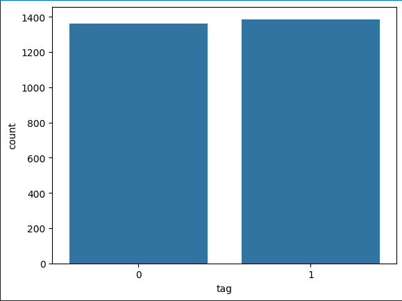

# Report

## Members

- Juan Esteban Duque Taborda (A00376778)
- Juan Camilo Bernal Marín (A00375413)
- Cristian Felipe Perafan Chilito (A00)  

# Introduction

Sentiment analysis, also known as opinion mining, is a field of natural language processing (NLP) that aims to determine the sentiment expressed in a piece of text. It has significant applications in understanding customer opinions, social media analysis, and feedback analysis. In this report, we will explore the process of sentiment analysis using machine learning models, starting with a baseline using a DummyClassifier and progressing to more complex models like vanilla Recurrent Neural Networks (RNN) and Long Short-Term Memory networks (LSTM).

# Objetives

##  Main Objective

- Evaluate and compare the performance of baseline and advanced sentiment analysis models on the Sentiment Labelled Sentences dataset, aiming to provide insights into the effectiveness of these models for capturing sentiment in textual data.

## Specific Objectives: 

1. Collect the Sentiment Labelled Sentences dataset from the UCI Machine Learning Repository, ensuring a comprehensive and representative sample of labeled sentiment data.

2. Preprocess the acquired dataset through tokenization, lowercase conversion, and removal of stopwords using NLTK. Structure the data to facilitate supervised learning tasks.

3. Implement a DummyClassifier as a baseline model for sentiment analysis. Train the model on the preprocessed data and assess its performance in terms of accuracy, precision, recall, and F1-score, establishing a reference point for further comparisons.

4. Develop and implement a vanilla Recurrent Neural Network (RNN) and a Long Short-Term Memory (LSTM) network for sentiment analysis. Train both models on the preprocessed data, evaluate their performance using accuracy, precision, recall, F1-score, and kappa, and identify optimal hyperparameters using techniques like GridSearchCV.

5. Compare the results obtained from the DummyClassifier, vanilla RNN, and LSTM models, analyzing their strengths and weaknesses in capturing sentiment. Provide insights into the potential benefits of advanced models over baseline approaches.

This report aims to explore the landscape of sentiment analysis models, from a simplistic baseline to more intricate neural network architectures. The specific objectives focus on acquiring, preprocessing, and evaluating models, providing a comprehensive understanding of their performance on sentiment-labeled data.

# Preliminary steps before analysis

## Dataset
The Sentiment Labelled Sentences dataset typically includes labeled text data, where each piece of text (such as a sentence or a review) is associated with a sentiment label. The sentiment labels are often binary, indicating whether the sentiment expressed in the text is positive or negative. The dataset is commonly used for sentiment analysis tasks, where the goal is to build models that can automatically determine the sentiment conveyed in a given piece of text.

**Contents of the Dataset:**

The dataset contains a collection of sentences or phrases extracted from various sources, such as product reviews, movie reviews, or social media comments. Each piece of text is paired with a sentiment label, typically binary, indicating whether the sentiment is positive or negative.

**Use Cases:**

- _Sentiment Analysis_:
    The primary use of this dataset is in sentiment analysis tasks. Researchers and practitioners leverage this dataset to train and evaluate models that can automatically classify the sentiment expressed in textual data.

- _Natural Language Processing (NLP) Research_:
    The dataset is employed in natural language processing research to explore and advance techniques for sentiment analysis. It provides a standardized benchmark for evaluating the effectiveness of different models and algorithms.

- _Machine Learning and Text Mining_:
    It serves as a valuable resource for training and testing machine learning models, especially those focused on text mining and sentiment classification.

## Preprocesses

Now that the dataset has been explained, let's go deeper into the previous steps before getting to the models.

The previous steps before the implementation of the models, the NLTK and Pandas import is performed. After this the tokenizer (punkt) is added to decipher the complexities of the textual nuances, and then the stopwords to remove from the text the words that do not contribute in the sentiment analysis, some of these words are "and", "or", among others.

Next, the three files are read with Pandas, and each one is saved in a different variable. It is stored in rows and columns, each row being a sentence of the file, and the columns are the positive (1) or negative (0) side of the text.

Then comes the tokenization and deletion step, here only numeric and alphabetic characters are left, and special characters are excluded, this in turn is stored in a variable respectively. This process is performed for all three files. Finally, the three variables are joined in a combined variable where the sentiments of each of the files are stored.

## Exploratory Data Analysis (EDA)

For this exploratory data analysis, we will take the "_combined_sentiments_df_" file and first check how many sentiments are positive (1) and negative (0), which are fairly balanced. For the positive (1) we have 1386, and for the negative (0) we have 1362. 



This graphical representation elucidates the balance or imbalance between positive and negative sentiments, facilitating an initial grasp of the dataset's sentiment distribution.

After that, we made three different word clouds according to each file. These clouds represent the set of most frequent words within the Amazon, IMDb and Yelp sentiment tagged datasets. These word clouds, provide an aesthetic representation of the dominant terms in each dataset.


This representation shows the most dominant positive and negative words in the Amazon archive.


This representation shows the most dominant positive and negative words in the IMBd archive.


This representation shows the most dominant positive and negative words in the Yelp archive.

Finally, the dataset is subjected to a strategic partitioning into training and test sets. This partitioning given via the "_train_test_split_" function of the esteemed scikit-learn library ensures excellent separation for the subsequent training and evaluation of sentiment analysis models. This phase lays the foundation for rigorous exploration of the intersection between natural language and machine learning.

# Sentiment Analysis Models

## 1. DummyClassifier

The `DummyClassifier` in scikit-learn is a simplistic and elementary classification model that serves as a baseline for comparison when evaluating the performance of more sophisticated classifiers. Its primary purpose is to establish a benchmark by providing a straightforward prediction strategy. This classifier is especially useful in the early stages of model development to gauge the relative success of more advanced models.

### Key Characteristics of DummyClassifier

The `strategy='prior'` parameter indicates that the DummyClassifier is employing a strategy based on the prior probabilities of the classes in the training set. The DummyClassifier is not designed for predictive accuracy or robust performance. Instead, it acts as a baseline to assess whether more sophisticated models provide meaningful improvements over a simple, naive approach.

### How It Works

In the case of `strategy='prior'`, the DummyClassifier predicts the class with the highest prior probability observed in the training set for all instances in the test set.

### Model Application in the Code

**Initialization:**
The DummyClassifier is instantiated with random_state=43 for reproducibility, and the chosen strategy is 'prior'.

**Training:**
The model is trained using the training set (X_train and Y_train). However, it is important to note that the DummyClassifier does not learn any underlying patterns in the data. It simply memorizes the class distribution observed during training.

**Prediction:**
The trained DummyClassifier is then used to predict the labels for the test set (X_test). Predictions are made based on the prior probabilities of classes observed during training.

```python
clf_dummy = DummyClassifier(random_state=43,strategy='prior')
clf_dummy.fit(X_train, Y_train)

y_pred = clf_dummy.predict(X_test)
```

### Evaluation Metrics

After predictions are obtained (y_pred), various performance metrics are calculated to evaluate the DummyClassifier's effectiveness. These metrics include a confusion matrix, accuracy, precision, recall, and F1-score. These metrics provide a comprehensive assessment of the model's ability to correctly classify instances. After explaining the metrics used to evaluate the methods, the prediction shown by this model will be shown.

## 2. RNN Model

A Recurrent Neural Network (RNN) is a type of neural network architecture designed to work with sequential data or data with temporal dependencies. Unlike traditional feedforward neural networks, which process inputs in a fixed order, RNNs are equipped to handle sequences of data by maintaining a hidden state that captures information about previous elements in the sequence. This makes them particularly well-suited for tasks such as natural language processing, speech recognition, and time series analysis.

Before performing the analysis we must add a tokenizer and process the text.

### Tokenization and Text Preprocessing

The code utilizes the Keras Tokenizer class to convert the text data into sequences of integers. It limits the vocabulary size to 1000 words. The tokenizer is fitted on the training data (X_train), converting the sentences into sequences of integers based on word frequency. The training and test sets (X_train and X_test) are transformed into sequences of integers using the trained tokenizer.

### Data Padding

The sequences are then padded to ensure uniform length. All sequences are padded or truncated to a maximum length of 20, enhancing compatibility for model training. The data is reshaped to be compatible with the RNN architecture. For the training set (X_train_rnn), an additional dimension of 1 is introduced.

Now we can build the RNN model and start its analysis.

### RNN Model Architecture

An Embedding layer is introduced to convert sequences of integers into dense vectors. The layer has a vocabulary size of 1000, each word represented by a 200-dimensional vector. A SimpleRNN layer follows the Embedding layer. This layer captures sequential dependencies in the data.

A dropout layer is included to mitigate overfitting by randomly setting a fraction of input units to zero during training.A dense layer with two neurons is added for binary classification (positive or negative sentiment).

The output layer employs a sigmoid activation function to produce outputs between 0 and 1, facilitating binary classification. The model uses the Adam optimizer with a specified learning rate. It is compiled with sparse categorical crossentropy loss and accuracy as the evaluation metric.

```python
def get_rnn(learning_rate=0.001,activation='sigmoid',metric='accuracy',dropout=0.01):
    # Binary classification Positive or Negative
    num_classes = 2

    # Model where layers are stacked sequentially
    model = Sequential()
    # Convert sequence of integers to sequence of dense vectors
    model.add(Embedding(vocab_size, 200, input_length=maxlen))

    model.add(SimpleRNN(200, input_shape=(maxlen,1),return_sequences=False))

    # Dropout layer to prevent overfitting
    model.add(Dropout(dropout))

    # Each neuron is connected to the before layer
    model.add(Dense(num_classes))
        
    # Produce ouputs between 0 and 1
    model.add(Activation(activation))

    model.summary()

    adam= optimizers.Adam(learning_rate)

    #Compile the model
    model.compile(loss='sparse_categorical_crossentropy',optimizer=adam,metrics=[metric])

    return model
```

We will proceed with the training of the RNN.

### Model Training

The KerasClassifier is employed to use the Keras model as a scikit-learn estimator. This facilitates compatibility with scikit-learn utilities like GridSearchCV. The model is trained on the training data (X_train_rnn and Y_train) for 10 epochs with a batch size of 64.

### Prediction

The trained model is used to predict sentiment labels for the test set (X_test_np), producing y_pred.

### Evaluation Metrics

The script calculates and prints key performance metrics such as accuracy, precision, recall, and F1-score to evaluate the model's effectiveness on the test set (Y_test and y_pred).

We now perform the measurement with the trained model, this does not mean that this is the best measurement. Now we are going to prepare the RNN to return the best sentiment analysis.

### Hyperparameter Grid Search

**Parameter Grid Definition:**
A parameter grid (param_grid) is defined to explore different combinations of hyperparameters, including learning rate, activation function, evaluation metric, and dropout rate.

**Grid Search Initialization:**
A GridSearchCV object is instantiated, utilizing the scikit-learn's GridSearchCV function. It is configured to use the previously defined Keras model (model) as the estimator and the specified parameter grid.

**Model Definition within Grid Search:**
The function get_rnn is modified to accept hyperparameters as arguments. This function defines the RNN model architecture using Keras with specified hyperparameters.

```python
param_grid = {
    'learning_rate': [0.001, 0.01, 0.1],
    'activation': ['relu', 'sigmoid','softmax','tanh'],
    'metric': ['accuracy', 'mean_squared_error','cosine_proximity'],
    'dropout': [0.01,0.1,0.2]
}

grid = GridSearchCV(estimator=model, param_grid=param_grid, cv=3)
```

With the hyperparameters built, we will now build the model that returns the best result.

### New Model Training and Evaluation

Another instance of the Keras model (new_model) is defined with the same architecture as before but without the Grid Search parameters. The new model is trained on the training data (X_train_rnn and Y_train) for 10 epochs with a batch size of 64.

The script then evaluates the performance of the new model on the test set (X_test_np). For the measurement of the new model, we performed the same analyses that were performed on the test model.

## 3. LSTM Model

Long Short-Term Memory (LSTM) is a type of recurrent neural network (RNN) architecture designed to overcome some of the limitations of traditional RNNs in capturing long-term dependencies in sequential data. The key challenge that LSTMs address is the vanishing gradient problem, which occurs during the training of deep neural networks, especially when dealing with long sequences.

This model is similar to the previous one, so many of the RNN steps are repeated. So we will make the most simplified explanation in this case.

**Tokenization and Padding:**
Tokenizes the text data using a Keras Tokenizer object, limiting vocabulary size to 1000 words. Pads the sequences to a maximum length of 20.

**Model Architecture (Original):**
Defines an LSTM-based model using Keras with an Embedding layer, LSTM layer, Dropout layer, Dense layer, and an Activation layer. Compiles the model with specified hyperparameters such as learning rate, activation function, and metric.

```python
# Building the model
def get_lstm(learning_rate=0.001, activation='sigmoid', metric='accuracy', dropout=0.01):
    num_classes = 2

    model = Sequential()
    model.add(Embedding(vocab_size, 200, input_length=maxlen))
    model.add(LSTM(200, input_shape=(maxlen, 1), return_sequences=False))
    model.add(Dropout(dropout))
    model.add(Dense(num_classes))
    model.add(Activation(activation))

    model.summary()

    adam = optimizers.Adam(learning_rate)
    model.compile(loss='sparse_categorical_crossentropy', optimizer=adam, metrics=[metric])

    return model
```

**Data Transformation for LSTM:**
Reshapes the input data to be compatible with the LSTM model.

**KerasClassifier Initialization:**
Creates a KerasClassifier using the original LSTM model architecture.

After preparing the LSTM model, we proceed to train it. The measurement performed is the same as in the previous models.

### Model Training and Prediction (Original):
Trains the original LSTM model on the training data (X_train_lstm and Y_train).
Predicts on the test set (X_test_lstm), calculating and printing accuracy, precision, recall, and F1-score.

Once the training is done, hyperparameters will be performed to improve the model.

### Hyperparameter Grid Search:
Defines a parameter grid for hyperparameter tuning using GridSearchCV.
Conducts a grid search to find the best hyperparameters, but this section is currently commented out (# grid_result = grid.fit(X_train_lstm, Y_train)).

```python
# Tuning the model
param_grid = {
    'learning_rate': [0.001, 0.01, 0.1],
    'activation': ['relu', 'sigmoid', 'softmax', 'tanh'],
    'metric': ['accuracy', 'mean_squared_error', 'cosine_proximity'],
    'dropout': [0.01, 0.1, 0.2]
}

grid = GridSearchCV(estimator=model, param_grid=param_grid, cv=3)
```

As in the case of the RNN, the model is rebuilt for the LSTM to return the best analysis.

### Model Architecture (Tuned):
Defines a new LSTM-based model using Keras with the same architecture as the original, but with hyperparameters obtained from the grid search.

### KerasClassifier Initialization (Tuned):
Creates a new KerasClassifier using the tuned LSTM model architecture. And finally we perform the measurement to obtain the best analysis, this we do with the same measurement that was done in the test.

# Performance evaluation of the models

For this part of the report, we will show the results of each of the sentiment analyses performed, and at the end we will give the reasons why LSTM was better than the others.

### DummyClassifier results

**Accuracy = 47.27%**

|          | Presicion | Recall | F1 - score |
|----------|-----------|--------|------------|
| Class 0  | 0.0       | 0.0    | 0.0        |
| Class 1  | 0.47      | 1.0    | 0.64       |

The DummyClassifier essentially predicts the majority class (Class 1) every time. As a result, it achieves high recall for Class 1 but performs poorly in terms of precision and accuracy. The warning about ill-defined precision indicates that precision for Class 0 is 0.0 because there are no predicted samples for that class. The DummyClassifier method is only used to have a baseline for how difficult the problem will be to deal with.

### RNN test model

**Accuracy = 72.47%**

|          | Presicion | Recall | F1 - score |
|----------|-----------|--------|------------|
| Class 0  | 71.10%    | 79.77% | 75.35%     |
| Class 1  | 74.04%    | 64.36% | 68.86%     |


**Accuracy:** The RNN achieves a relatively high accuracy on the test set (72.49%), indicating that it correctly classifies sentiments for a significant portion of the data.

**Precision:** The precision for Class 0 and Class 1 is balanced, with Class 1 having a slightly higher precision (74.04%). This suggests that when the RNN predicts positive sentiments (Class 1), it is generally correct.

**Recall:** The recall for Class 0 and Class 1 is imbalanced. While the RNN has high recall for Class 0 (79.77%), indicating a good ability to capture true negatives, the recall for Class 1 is lower (64.36%), indicating some difficulty in capturing all positive instances.

**F1-Score:** The F1-scores for both classes are reasonably balanced, reflecting a trade-off between precision and recall.

### RNN Best model

**Accuracy = 70.42%**

|          | Presicion | Recall | F1 - score |
|----------|-----------|--------|------------|
| Class 0  | 71.75%    | 72.41% | 72.08%     |
| Class 1  | 68.91%    | 68.21% | 68.56%     |

**Best Model Analysis:** The best model's performance is slightly lower than the overall test set performance, indicating that hyperparameter tuning did not lead to a significant improvement.

### LSTM test model

**Accuracy = 73.45%**

|          | Presicion | Recall | F1 - score |
|----------|-----------|--------|------------|
| Class 0  | 76.47%    | 71.72% | 74.02%     |
| Class 1  | 70.50%    | 75.38% | 72.86%     |

**Accuracy:** The LSTM outperforms the RNN in terms of accuracy, achieving a higher accuracy on the test set (73.45%).

**Precision:** The precision for Class 0 and Class 1 is balanced, with slightly higher precision for Class 0 (76.47%). This indicates that when the LSTM predicts negative sentiments (Class 0), it is generally correct.

**Recall:** The recall for Class 0 and Class 1 is more balanced compared to the RNN. The LSTM has good recall for both positive (Class 1) and negative (Class 0) sentiments.

**F1-Score:** The F1-scores for both classes are balanced, reflecting a good trade-off between precision and recall.

### LSTM Best model

**Accuracy = 75.76%**

|          | Presicion | Recall | F1 - score |
|----------|-----------|--------|------------|
| Class 0  | 74.95%    | 81.15% | 77.92%     |
| Class 1  | 76.84%    | 69.74% | 73.12%     |

**Best Model Analysis:** The best model's performance is higher than the overall test set performance, indicating that hyperparameter tuning led to a significant improvement. This underscores the effectiveness of LSTM in capturing sequential patterns and dependencies for sentiment analysis.

# Comparative analysis of the models

In this part of the report it is also important to analyze the use of the "Keras" and "Sklearn" libraries, since they affect the development of the method in the case of "Keras" in RNN and LSTM, but also affect how developed and specialized the library is to be used.

The difference in accuracy between the methods (sklearn and Keras) lies in the underlying frameworks and the nature of the models used (RNN and LSTM). Let us look at the differences and understand why Keras, with LSTM, can lead to better results compared to RNN and sklearn with a simple DummyClassifier.

### Sklearn:
Scikit-learn, commonly referred to as sklearn, is an open-source machine learning library for the Python programming language. It provides a simple and efficient set of tools for data analysis and modeling, including various machine learning algorithms for tasks such as classification, regression, clustering, and dimensionality reduction.

### DummyClassifie with Sklearn
Sklearn's DummyClassifier is a simple baseline model that makes predictions based on simple rules. Sklearn is not specifically designed for deep learning and does not provide extensive support for neural networks with complex architectures.

### Keras:
Keras is a high-level deep learning library that provides an easy-to-use API for building and training neural networks. 
Keras is ideal for building and training deep learning models, including RNNs and LSTMs.

Now let's see how the methods used affect the result according to what they were created for.

### Recurrent Neural Network (RNN)

In sentiment analysis, where understanding context and dependencies between words is crucial, a simple RNN may have difficulty capturing long-term dependencies in text.

### Long short-term memory (LSTM)

LSTMs are a type of RNN specifically designed to solve the leaky gradient problem. They include memory cells and activation mechanisms that allow them to capture long-term dependencies in sequential data. In sentiment analysis, where understanding context and long-range dependencies is crucial, the LSTM's capability to retain and utilize information over longer sequences proves advantageous.

And the most important reason why Keras performs better on LSTMs than RNNs is because of the expressiveness and flexibility it offers, since complex architectures can be built, more specifically, deep learning models like LSTMs.

# Conclusion

In this study, we conducted a comprehensive evaluation and comparison of sentiment analysis models on the Sentiment Labelled Sentences dataset. Our approach included the implementation of a baseline DummyClassifier and advanced models such as the vanilla Recurrent Neural Network (RNN) and Long Short-Term Memory (LSTM) networks. The dataset underwent meticulous preprocessing, incorporating tokenization, lowercase conversion, and stopword removal using the NLTK library to structure the data for supervised learning. The DummyClassifier served as a benchmark, and the results showcased the superior performance of the RNN and LSTM models, emphasizing the significance of deep learning architectures in capturing sentiment nuances within textual data. Hyperparameter tuning, facilitated by GridSearchCV, allowed for the identification of optimal model configurations, contributing to a thorough understanding of the models' capabilities.

Overall, the study not only achieved its main objective of evaluating and comparing sentiment analysis models but also provided valuable insights into the effectiveness of advanced models for sentiment analysis tasks. The findings highlight the advantages of employing deep learning techniques, particularly RNN and LSTM networks, in capturing sentiment nuances compared to simpler baseline approaches. This exploration contributes to the broader understanding of sentiment analysis methodologies, offering guidance for future endeavors in similar natural language processing applications.